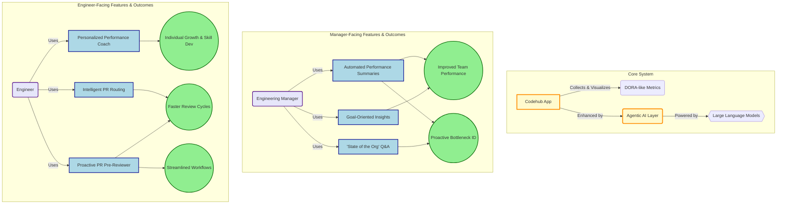

+++
date = '2025-06-21T10:01:03-08:00'
draft = false
title = 'Agentic Features for Codehub: Engineering Metrics Intelligence'
tags = ['engineering', 'ai']
+++

Integrating agentic features into Codehub app is an excellent way to enhance its value proposition, moving it from a data visualization tool to an intelligent assistant for engineers and managers. In this article I'm brainstorming (with AI) several agentic features, categorized by the problems they solve and the personas they target.

<!--more-->

This brainstorming is based on these docs:
- [Agentic Applications]()
- [Engineering excellence metrics (Engineering)]()
- [Engineering Excellence Metrics]()
- [Team Productivity Metrics]()
- [PR Lifecycle]()
- [Codehub Project - Week 1]()
- [Codehub Project - Week 2]()

### For Engineering Managers

As a manager, your primary concerns are team performance, identifying bottlenecks, recognizing achievements, and fostering a healthy engineering culture. Agentic features can help you achieve these goals more effectively.

#### Automated Performance Summaries and Anomaly Detection
Instead of manually digging through dashboards, an agent can proactively deliver concise, natural language summaries of team and organizational performance.

* **How it works:** The agent could send a weekly digest via Slack or email that highlights key trends, such as a sudden drop in deployment frequency or a significant increase in abandoned pull requests. It could say, for example:
    > "This week, the Alpha team's average time to merge a pull request increased by 15%. This seems to be correlated with an increase in PR size. You might want to investigate if breaking down work into smaller chunks is needed."
* **Agentic Quality:** The agent isn't just presenting data; it's interpreting it, identifying potential root causes, and suggesting a course of action.

#### Goal-Oriented Insights
Managers often have specific improvement goals, like "reduce code review time." An agent can be tasked with monitoring progress and providing actionable advice.

* **How it works:** A manager could set a goal within Codehub: "Reduce the average PR review time to under 24 hours for the Phoenix team." The agent would then monitor the relevant metrics and proactively suggest interventions. For instance, it might identify that a few specific engineers are consistently slow to review PRs and suggest a conversation about their current workload. It could also highlight PRs that have been sitting in review for too long and notify the appropriate channel.
* **Agentic Quality:** The agent actively works towards a user-defined goal, breaking it down into smaller, manageable steps and providing continuous feedback.

#### "State of the Org" Q&A
Enable managers to ask complex questions in natural language and get immediate, data-backed answers.

* **How it works:** A manager could ask, "Which team has had the highest increase in deployment frequency over the last quarter?" or "Show me the engineers with the most abandoned pull requests and their associated comments." The agent would parse the natural language query, retrieve the relevant data, and present it in a clear, understandable format.
* **Agentic Quality:** The agent understands user intent, navigates the data landscape, and synthesizes information to provide a direct answer, saving the manager significant time and effort.

### For Engineers

Engineers are focused on writing high-quality code, getting it reviewed and merged efficiently, and understanding their own performance. Agentic features can streamline their workflows and provide personalized feedback.

#### Personalized Performance Coach
Each engineer could have a private, AI-powered coach that helps them interpret their own DORA-like metrics and suggests areas for improvement.

* **How it works:** The agent could provide weekly insights like:
    > "Hi Sarah, you had three pull requests merged this week, which is above your average. However, your average commit size was 500 lines of code, which is larger than the team average. Consider breaking down your next feature into smaller, more frequent commits."
    This feedback is private and developmental, not punitive.
* **Agentic Quality:** The agent provides personalized, context-aware feedback to help individuals grow, acting as a supportive mentor rather than a performance tracker.

#### Proactive Pull Request "Pre-Reviewer"
Before an engineer even submits a pull request, an agent can analyze the changes and provide feedback.

* **How it works:** As an engineer commits code, the agent could analyze it and offer suggestions directly in the IDE or as a pre-commit hook. It might say:
    > "This pull request is larger than 80% of the team's recent PRs. Consider splitting it into two smaller PRs for faster review."
    Or:
    > "You haven't included any tests for your new function. Adding unit tests will likely speed up the approval process."
* **Agentic Quality:** The agent anticipates potential issues that could slow down the review process and provides proactive guidance to improve the quality and efficiency of code submissions.

#### Intelligent PR Routing and Reviewer Suggestions
Instead of manually selecting reviewers, an agent can suggest the best people to review a particular pull request.

* **How it works:** When a PR is created, the agent can analyze the code changes and suggest reviewers based on who has the most expertise in that area of the codebase, who has recently worked on related files, and who currently has the bandwidth to provide a timely review. It could even automatically assign reviewers based on pre-defined team rules.
* **Agentic Quality:** The agent understands the team's structure and expertise, and it can make intelligent decisions to optimize the code review process, reducing wait times and improving the quality of feedback.

### How to Get Started

1.  **Start Small:** Choose one or two high-impact agentic features to implement first. The "State of the Org" Q&A for managers or the personalized performance coach for engineers are often good starting points as they provide immediate and tangible value.
2.  **Focus on the User Experience:** The success of these features will depend heavily on how they are presented. Ensure the language is supportive and developmental, not critical or judgmental. The goal is to empower users, not to create a sense of being constantly monitored.
3.  **Leverage Large Language Models (LLMs):** The natural language understanding and generation capabilities of modern LLMs are essential for creating truly agentic experiences. You'll likely need to integrate with a powerful LLM API.
4.  **Gather Feedback and Iterate:** Once you release your first agentic features, closely monitor how they are being used and gather feedback from your users. This will be crucial for refining the features and identifying new opportunities.

By adding these types of agentic features, you can transform Codehub from a passive reporting tool into an active partner in improving engineering excellence. This will not only make the application more "fun" and engaging but also deeply embed it into the daily workflows of both engineers and managers.

