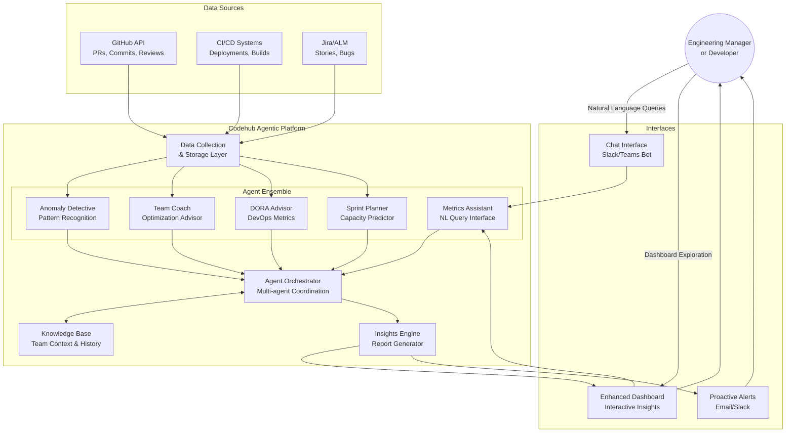

+++
date = '2025-06-21T12:01:03-08:00'
draft = false
title = 'Agentic Features for Codehub: Engineering Metrics Intelligence (part 2 of 2)'
tags = ['engineering', 'ai']
+++

Enhancing Codehub application with agentic capabilities can transform it from a static reporting tool into an intelligent engineering insights platform that proactively helps teams improve their performance and productivity.

See also [Agentic Features for Codehub: Engineering Metrics Intelligence (part 1 of 2)]()

<!--more-->

## Current Codehub Overview

**Existing Features:**
- GitHub PR statistics collection for developers
- Engineering excellence scorecards (commits, merged/abandoned PRs, lines of code (LOC), deployments)
- DORA-like productivity metrics
- Multi-level aggregation: Engineer → Team → Organization

## Proposed Agentic Features

### 1. **Intelligent Metrics Assistant**

**Capability**: Natural language interface for metrics exploration
- *"Show me Sarah's code review turnaround time compared to team average"*
- *"Which team had the most deployment failures last quarter?"*
- *"Alert me when any engineer's PR abandonment rate exceeds 15%"*

**Agent Type**: Hybrid (Reactive + Deliberative)

### 2. **Performance Anomaly Detective**

**Capability**: Proactive identification of performance patterns and anomalies
- Detects unusual drops in productivity metrics
- Identifies potential burnout indicators (overtime commits, weekend activity)
- Spots code quality degradation trends
- Suggests intervention timing

**Agent Type**: Learning Agent with predictive capabilities

### 3. **Team Optimization Coach**

**Capability**: Data-driven recommendations for team improvement
- Analyzes team collaboration patterns
- Suggests optimal code review assignments
- Identifies knowledge bottlenecks and skill gaps
- Recommends team restructuring for better velocity

**Agent Type**: Cognitive Agent with strategic reasoning

### 4. **DORA Metrics Advisor**

**Capability**: Specialized agent for DORA metrics optimization
- Tracks Lead Time, Deployment Frequency, MTTR, Change Failure Rate
- Provides actionable insights for DevOps improvement
- Benchmarks against industry standards
- Creates improvement roadmaps

**Agent Type**: Deliberative Agent with goal-oriented planning

### 5. **Sprint Planning Intelligence**

**Capability**: Predictive capacity planning and sprint optimization
- Estimates team velocity based on historical data
- Accounts for individual developer patterns and availability
- Suggests optimal work distribution
- Predicts sprint risks and bottlenecks

**Agent Type**: Hybrid Agent with forecasting

## Reference Architecture: Codehub Agentic Enhancement

### Problem Statement

**Current Challenge**: 
- Static dashboards require manual interpretation
- Reactive approach to performance issues
- Time-consuming manual analysis for insights
- Difficulty correlating metrics across different dimensions

**Agentic Solution**: Transform Codehub into an intelligent system that proactively analyzes, interprets, and provides actionable insights from engineering metrics.

### Proposed Architecture



### Example Agent Interactions

#### 1. **Anomaly Detection Scenario**
```
🤖 Anomaly Detective: "Alert: John's PR review time has increased 
    by 300% this week. Possible causes: 
    - 5 complex PRs involving authentication module
    - 3 PRs pending architectural review
    
    Recommendation: Escalate arch reviews to senior team members"
```

#### 2. **Team Optimization Scenario**
```
User: "Our team's velocity has been declining. What's wrong?"

🤖 Team Coach: "Analysis shows:
    • Code review bottleneck: 60% of PRs wait >2 days for review
    • Knowledge concentration: 70% of backend PRs reviewed by Sarah only
    • Technical debt: 40% increase in bug-fix PRs
    
    Recommendations:
    1. Cross-train 2 more developers on backend review
    2. Implement async review rotation
    3. Schedule tech debt sprint next quarter"
```

#### 3. **Sprint Planning Scenario**
```
🤖 Sprint Planner: "For next sprint planning:
    • Predicted velocity: 42 story points (based on 3-sprint avg)
    • Risk factors: Mike on vacation (−8 points), new junior dev (+training overhead)
    • Optimal allocation: 
      - Frontend: 18 points (Lisa, new dev + mentoring)
      - Backend: 24 points (Sarah, John)
    
    Suggested sprint commitment: 35-38 points with buffer"
```

## Implementation Strategy

### Phase 1: Foundation (Months 1-2)
- Enhance data collection with richer GitHub API integration
- Implement basic NL query interface (Metrics Assistant)
- Add anomaly detection for key metrics

### Phase 2: Intelligence (Months 3-4)
- Deploy Team Coach with optimization recommendations
- Integrate DORA Advisor with industry benchmarking
- Add proactive alerting system

### Phase 3: Prediction (Months 5-6)
- Implement Sprint Planning Intelligence
- Add predictive analytics for team performance
- Multi-agent orchestration and coordination

### Technical Stack Recommendations

**Agent Framework**: LangChain or CrewAI for multi-agent orchestration
**LLM Integration**: OpenAI GPT-4 or Anthropic Claude for reasoning
**Data Processing**: Python with pandas/numpy for metrics analysis
**Real-time Interface**: Slack/Teams bot integration
**Database**: Time-series DB (InfluxDB) for metrics history
**Visualization**: Enhanced with interactive AI-driven insights

## Benefits

- **Proactive Management**: Early detection of team performance issues
- **Data-Driven Decisions**: AI-powered insights for team optimization
- **Reduced Manual Work**: Automated analysis and reporting
- **Personalized Coaching**: Individual developer improvement suggestions
- **Predictive Planning**: Better sprint planning and capacity allocation
- **Continuous Improvement**: Learning from team patterns and industry benchmarks

This agentic enhancement transforms Codehub from a reporting tool into an intelligent engineering effectiveness platform that actively helps teams improve their performance and delivery capabilities.