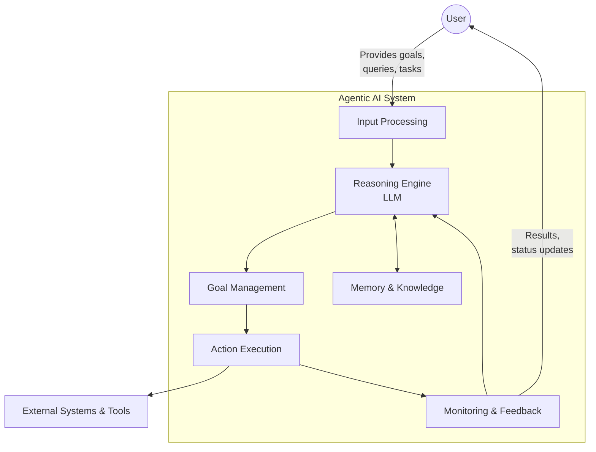
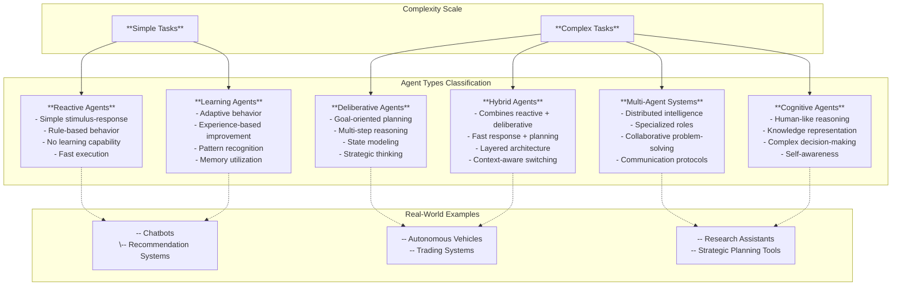
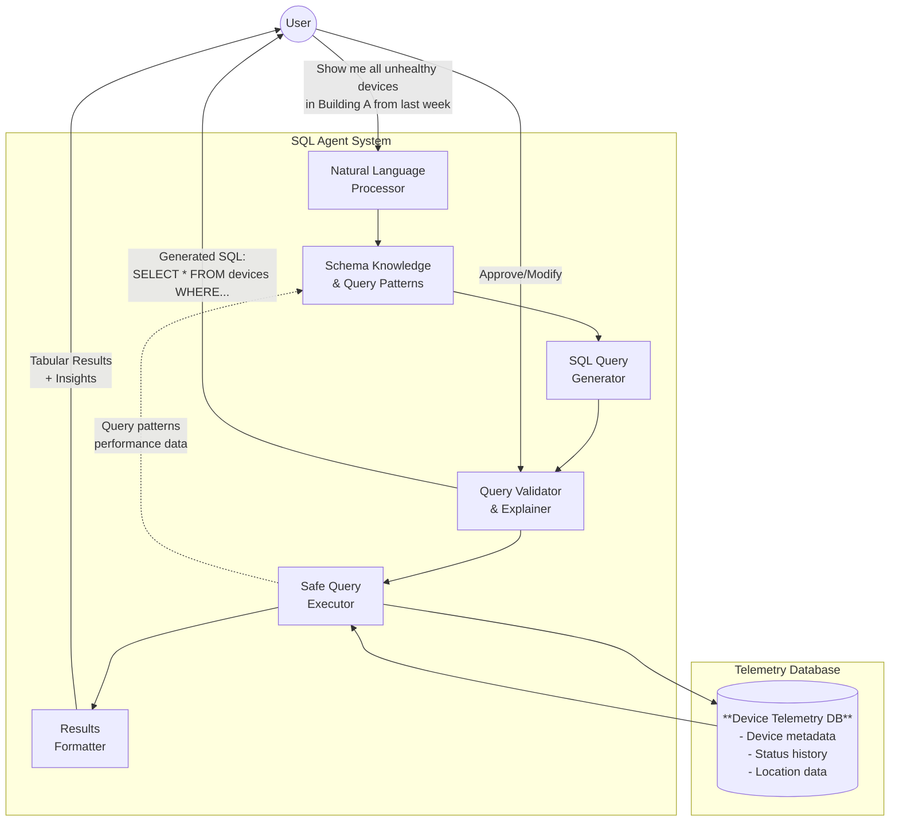

+++
date = '2025-06-20T22:01:03-08:00'
draft = false
title = 'Agentic Applications'
tags = ['engineering']
+++
Agentic applications represent a significant leap in AI, moving beyond simple chatbots to systems that can autonomously reason, plan, and execute multi-step tasks to achieve a defined goal. They are designed to operate with minimal human intervention, continuously learning and adapting over time.
<!--more-->

## Core Principles of Agentic Applications:

1. Autonomy: The ability to make decisions and act independently to achieve a goal.
2. Goal-Oriented: Designed with a clear objective in mind, which guides their actions.
3. Perception: Ability to collect, organize, and interpret data from their environment (e.g., user input, external systems, databases).
4. Reasoning and Planning: Utilizing an LLM or other AI models to understand tasks, generate solutions, and determine the necessary steps to achieve a goal.
5. Action Execution: The capability to interact with external tools, APIs, or systems to perform tasks.
Memory and Learning: Storing past interactions, experiences, and knowledge to improve performance and adapt to new situations over time.
5. Adaptability: Continuously improving processes based on data and feedback.
6. Multi-Agent Collaboration (Optional but Powerful): Multiple specialized agents working together to solve complex problems.


## Key Components of an Agentic AI Architecture:

1. Goal and Task Management:
   * Defines high-level objectives.
   * Breaks down complex goals into manageable subtasks.
   * Tracks progress towards completion and adapts goals as circumstances change.
2. Perception and Input Processing:
   * Gathers information from various sources (user queries, system logs, structured data from APIs, sensor readings, etc.).
   * Utilizes AI technologies like Natural Language Processing (NLP) for text, computer vision for images, or data extraction for structured data to interpret inputs.
   * Cleans, processes, and structures raw data into a usable format.
3. Memory and Knowledge Management:
   * Short-term memory: Stores information relevant to the current interaction or session.
   * Long-term memory: A persistent knowledge base (often using vector databases) that stores facts, accumulated data, and past experiences for semantic search and retrieval.
4. Reasoning and Planning Engine (Often Powered by LLMs):
   * The "brain" of the agent.
   * Understands the user's intent and the overall goal.
   * Generates a plan of action, including the sequence of steps and which tools to use.
   * May use techniques like Retrieval-Augmented Generation (RAG) to access proprietary data for more accurate and relevant outputs.
5. Action and Execution Module:
   * Enables the agent to interact with the environment and perform tasks.
   * Connects to external tools, APIs, and systems (e.g., searching the internet, executing code, sending emails, interacting with databases).
   * Monitors execution and adjusts if needed.
6. Integration and Orchestration Layer:
   * Connects all the components, handling communication, scheduling, and workflow control.
   * In multi-agent systems, it orchestrates collaboration between different agents.
   * Ensures robust error handling and recovery.
7. Monitoring, Feedback, and Governance:
   * Continuously monitors agent actions and outcomes.
   * Implements feedback loops for continuous learning and correction.
   * Enforces policies (security, ethical, performance standards) and provides audit trails.



## Steps to Build an Agentic Application:

1. Define Your AI Agent's Purpose and Goals:
   * Clearly articulate the problem the agent will solve and its specific objectives.
   * Decide the type of agent (reactive, learning, hybrid, multi-agent).
2. Set Up Your Development Environment:
   * Install Python (if using Python, which is common for AI/ML).
   * Set up a virtual environment to manage dependencies.
   * Install essential libraries (e.g., numpy, pandas, langchain, crewAI, autogen, LLM APIs like OpenAI, Google Cloud, etc.).
3. Collect and Prepare Data:
   * Gather relevant, high-quality data for your agent's task (e.g., customer behaviors, transaction histories, documents for RAG).
   * Clean, preprocess, and label the data as needed.
4. Choose and Train Your AI Model (if applicable):
   * Select appropriate machine learning algorithms or leverage pre-trained LLMs.
   * Fine-tune models if necessary with your specific data.
5. Develop Agent Tools:
   * Create functions or APIs that your agent can call to interact with external systems or perform specific actions (e.g., a search tool, a code interpreter, a database query tool, an email sending tool).
   * Provide clear natural language descriptions for each tool and its parameters so the LLM can understand how and when to use them.
6. Implement the Agent Logic (Orchestration):
   * Prompt Engineering: Craft effective prompts for your LLM that define the agent's role, available tools, and how it should reason and plan.
   * Event Loop: Implement an event loop where the agent:
      * Receives input (perception).
      * Determines the next steps using the LLM (reasoning/planning).
      * Invokes appropriate tools (action execution).
      * Updates its internal state or memory.
      * Continues looping until the goal is achieved or instructed to stop.
   * Memory Integration: Integrate short-term and long-term memory components to maintain context and allow for learning.
7. Build a User Interface (UI):
   * Create an intuitive UI for users to interact with your agent (e.g., a chatbot interface using Streamlit, Gradio, or a web framework).
      * For example, [PyWebIO](https://github.com/pywebio/PyWebIO) the easiest possible way of building Python web app known by human civilization.
   * Test and Iterate:
      * Rigorously test your agent across various scenarios and inputs.
      * Monitor its performance, identify errors, and gather feedback.
      * Iterate on the agent's logic, prompts, and tools to improve its effectiveness and reliability.
      * Pay attention to "hallucinations" and unexpected behaviors.
8. Deploy and Monitor:
   * Deploy your agentic application to a production environment.
   * Implement real-time monitoring to track performance, identify issues, and ensure scalability.
   * Establish a feedback loop for continuous improvement and updates.

### Agent types



## Frameworks and Libraries:

Several frameworks and libraries simplify agentic application development:

1. LangChain: A popular framework for building applications with LLMs, providing tools for agent orchestration, memory, and tool integration.
2. CrewAI: A framework designed for orchestrating multiple AI agents to work collaboratively.
3. AutoGen (Microsoft): Enables building multi-agent conversations with customizable agents.
4. Spring AI: As a last resort. For Java developers, offers patterns like Chain Workflow and Parallelization Workflow for building LLM-based systems.
5. Amazon Bedrock's AI Agent framework: A cloud-based solution for building and deploying agents.

By following these steps and leveraging the right tools, you can develop powerful agentic applications that automate complex workflows, enhance decision-making, and provide more intelligent and autonomous experiences.

## Reference Architecture

Let's examine a practical example of an agentic application designed to solve a real-world data analysis problem.

### Problem Statement

**Challenge**: We have a database containing telemetry signals from physical devices with the following characteristics:
- Device metadata (name, location, status: healthy/unhealthy)
- Both current and historical data
- Complete history of device metadata and status changes
- Need for precise, accurate data extraction and insights

**Why Traditional RAG Won't Work**: 
- Requires precise answers, not approximate similarity-based responses
- Database queries need exact matching, not semantic similarity
- Critical operational data demands 100% accuracy

### Proposed Agentic Architecture

**Solution**: A SQL-Agent that acts as an intelligent database interface with the following capabilities:

1. **Domain Knowledge**: Deep understanding of database schema and typical query patterns
2. **Natural Language Processing**: Converts user requests into precise SQL queries
3. **Interactive Validation**: Reviews generated queries with users before execution
4. **Safe Execution**: Executes approved queries and presents results in tabular format
5. **Query Optimization**: Suggests efficient query alternatives and explains results

### Architecture Flow



### Key Components:

1. **Natural Language Processor**: Interprets user requests and extracts intent
2. **Schema Knowledge Base**: Maintains understanding of database structure and common query patterns
3. **SQL Query Generator**: Converts natural language to precise SQL queries
4. **Query Validator**: Reviews queries for correctness and explains them to users
5. **Safe Executor**: Executes approved queries with proper error handling
6. **Results Formatter**: Presents data in clear, actionable tabular format

### Example Interaction:

**User Input**: *"Show me all devices that went from healthy to unhealthy in the last 24 hours"*

**Agent Response**: 
```sql
-- Generated Query for Review:
SELECT d.device_name, d.location, 
       prev.status as previous_status,
       curr.status as current_status,
       curr.timestamp as change_time
FROM devices d
JOIN device_history prev ON d.device_id = prev.device_id
JOIN device_history curr ON d.device_id = curr.device_id
WHERE prev.status = 'healthy' 
  AND curr.status = 'unhealthy'
  AND curr.timestamp > NOW() - INTERVAL 24 HOUR
  AND curr.timestamp > prev.timestamp
ORDER BY curr.timestamp DESC;
```

**User**: *"Looks good, execute it"*

**Agent**: *Executes query and returns formatted results with insights about failure patterns*

This architecture ensures precision while maintaining the autonomous, goal-oriented nature of agentic applications.


