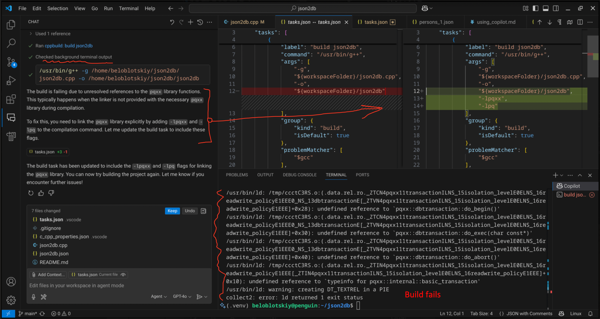
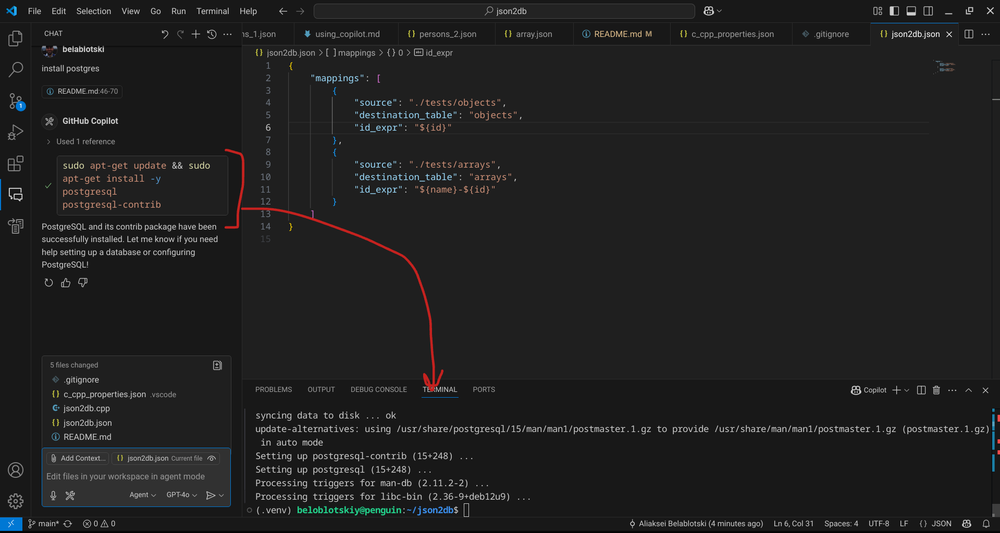
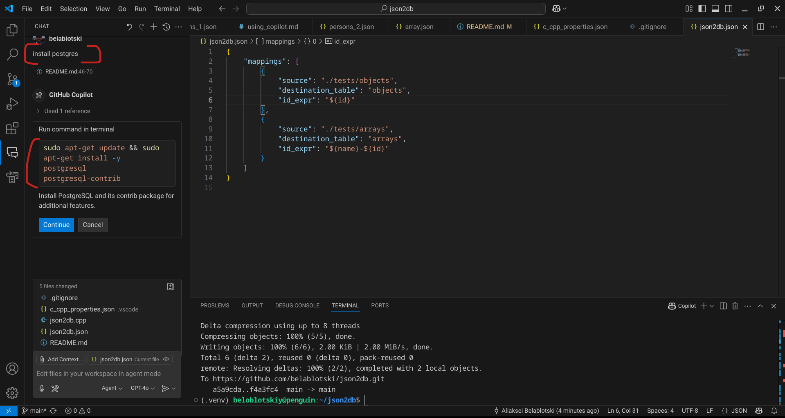
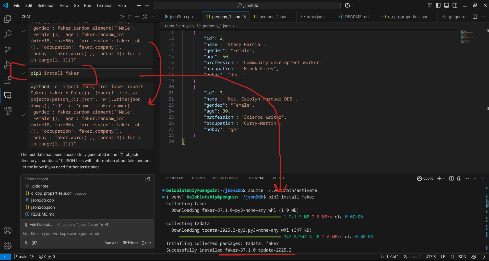
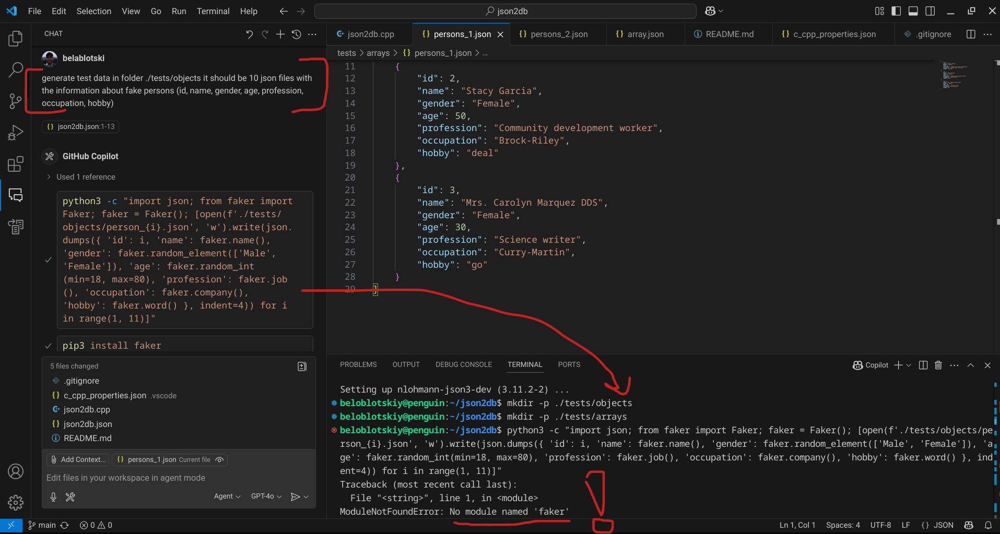
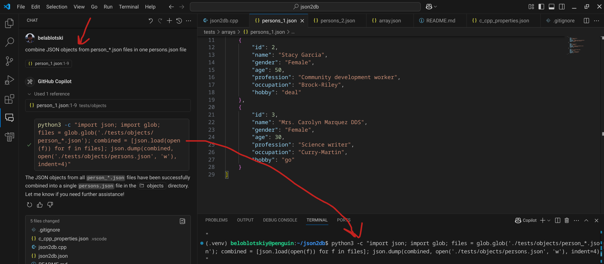
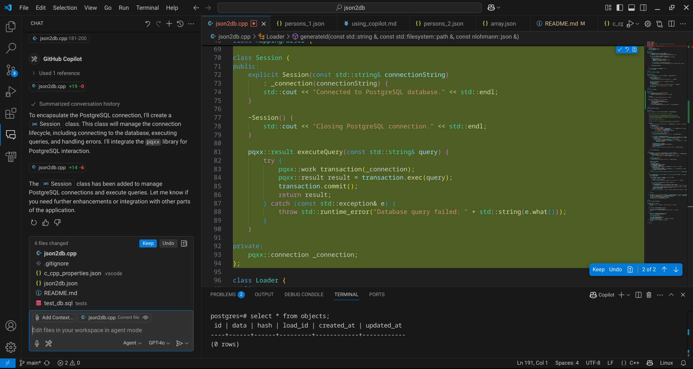

+++
date = '2025-05-01T18:00:00-08:00'
draft = false
title = 'My First Steps into Agentic Coding with VS Code'
tags = ['engineering', 'ai']
+++

I recently embarked on an interesting experiment with GitHub Copilot Agent that has given me some valuable insights into the evolving landscape of software development. I thought it would be worth sharing my experience and observations.

<!--more-->

## The Experiment: Building with AI Assistance

I decided to test GitHub Copilot Agent by building a C++ tool called `json2db` that imports JSON files into a PostgreSQL database. The project is available on [GitHub](https://github.com/belablotski/json2db) for anyone curious to explore the code.

What struck me most was how comprehensive the AI assistance proved to be. Not only did Copilot generate the entire codebase, but it also handled the local PostgreSQL server installation and setup process. This was particularly remarkable for me since I haven't worked with C++ in decades, yet I found I could still read and understand the generated code effectively.

## Shifting Roles: From Writer to Guide

This experiment has provided some fascinating insights into how engineering roles might be evolving. Rather than primarily writing code from scratch, I found myself in more of a guiding and reviewing capacity. The workflow shifted toward directing the agent's efforts and then carefully examining the generated output.

One important lesson emerged around the critical need for vigilance, particularly when the agent generates shell scripts or Python automation. These require thorough review before execution – acting as a safeguard becomes an essential part of the process.

As the project expanded, I noticed an interesting challenge: explaining the exact changes I wanted became more complex, and Copilot seemed to struggle with making clear-cut decisions in larger contexts. This suggests that context size and complexity significantly impact the effectiveness of AI assistance.

## Comparing Copilot's Interaction Modes

Through this experience, I observed distinct patterns in how different Copilot modes performed:

### "Ask" Mode
This mode excelled for targeted questions with narrow context. When I needed to recall a specific API format or understand a particular function, Ask mode provided focused, bottom-up assistance. It felt like having a knowledgeable colleague available for quick consultations about specific lines of code.

### "Agent" Mode  
Agent mode truly shined for project-wide changes and implementing larger architectural components. This is where the top-down approach became valuable – I could request broader changes and then drill down to review and refine the details.

Several capabilities impressed me about Agent mode:

- **Adaptive problem-solving**: When encountering missing library errors, it would automatically attempt to install dependencies and retry the previous operation
- **Environment configuration**: It successfully adjusted VS Code settings for the build process and even installed PostgreSQL on my Linux system, helping establish terminal connections
- **Context awareness**: The agent demonstrated an ability to understand existing code patterns and maintain consistency. Initially, it suggested private fields with trailing underscores, but after I modified a few examples to use leading underscores (my preferred convention), it adapted and began proposing code in the `_privateVariable` format

## Reflections on AI-Assisted Development

This exploration has offered a compelling glimpse into the potential future of software development. The experience suggests we might be moving toward a more collaborative relationship with AI tools, where engineers increasingly focus on architectural decisions, code review, and quality assurance rather than the mechanical aspects of coding.

The technology still has limitations – context management and decision-making in complex scenarios remain challenging. However, the capabilities demonstrated in this experiment point toward exciting possibilities for how we might approach software development in the coming years.

I'm curious to hear from others who have experimented with similar AI-assisted development workflows. What patterns have you observed? What challenges have you encountered? Feel free to share your experiences in the comments or reach out directly.

## Related Articles

- [Agentic Applications Overview]()
- [Offline LLM Inferencing]()
