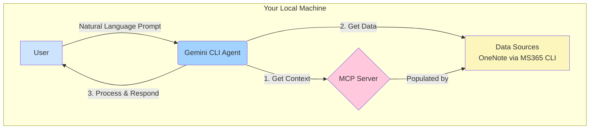
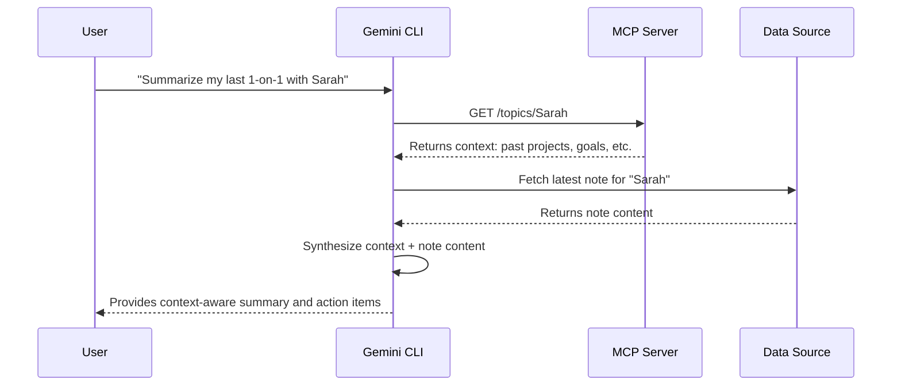
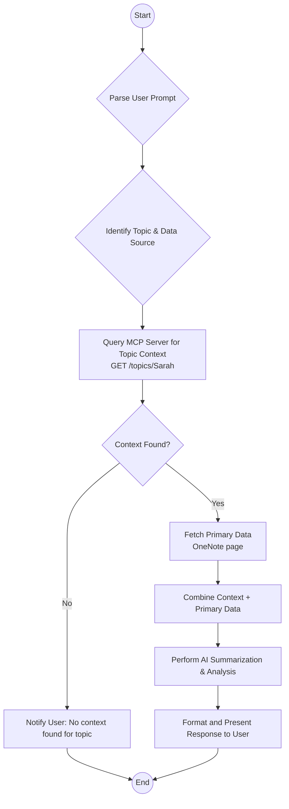

### **Design Proposal: A Context-Aware AI Assistant for Engineering Management**

**Version:** 1.0
**Date:** 2025-07-18

#### 1. Executive Summary

Engineering managers operate at the intersection of numerous information streams, leading to significant context-switching overhead and potential loss of critical information. This proposal outlines the design for a context-aware AI assistant, orchestrated by the Gemini CLI, to solve this problem. We will explore two solutions: a short-term workaround using a command-line bridge and the recommended long-term solution involving a dedicated local server. For the purpose of this document, we will define a conceptual **"Model Context Protocol (MCP)"** as the standard by which this server operates. The core of this document details the architecture, data flows, and API specifications for the MCP server, providing a blueprint for creating a powerful, private, and highly efficient personal automation system.

#### 2. Problem Statement

The daily workflow of an engineering manager involves processing and synthesizing information from disparate sources, including but not limited to:
*   **Communication:** Emails, Slack messages
*   **Project Management:** Jira tickets, project boards
*   **Knowledge Bases:** Confluence pages, Microsoft Docs on OneDrive
*   **Personal Notes:** OneNote pages for meetings, 1-on-1s, and brainstorming

This constant context switching is mentally taxing and inefficient. Standard AI assistants, while powerful, are "context-blind"—they process information in a vacuum without understanding the underlying relationships between people, projects, and historical data. This limits their ability to provide truly insightful assistance for tasks like preparing for a 1-on-1, summarizing project status, or following up on action items.

#### 3. Existing Challenges & Limitations

Generic automation platforms like Zapier or n8n can connect applications, but they do not solve the core problem of context-awareness. They can trigger actions based on events but cannot imbue an AI with a deep understanding of a manager's unique operational landscape.

#### 4. Solution Approaches

##### 4.1. Workaround: The CLI Bridge (`mcp-cli`)

A feasible short-term solution involves using the Gemini CLI's `run_shell_command` tool to interact with a command-line interface (`mcp-cli`) that acts as a bridge to a simple context store (e.g., a local JSON file or database).

*   **Pros:** Secure (no exposed ports), leverages existing tools, can be implemented quickly.
*   **Cons:** Indirect, less efficient, adds an extra layer of software to maintain, clunky architecture.

##### 4.2. Proposed Solution: Local MCP Server

The proper, long-term solution is to develop a local web server that implements our conceptual Model Context Protocol (MCP). This server acts as a dedicated, queryable "brain" for the AI assistant. The standard architecture to connect this to the Gemini ecosystem is by making the local server accessible via a secure tunnel.

*   **Pros:** Clean and direct architecture, highly efficient, scalable, provides a standard for context management.
*   **Cons:** Requires development of a local server and exposing it via a secure tunnel (e.g., ngrok, Cloudflare Tunnel).

This proposal will now focus on the detailed design of this superior solution.

---

#### 5. Detailed Design: The MCP Server Architecture

##### 5.1. High-Level Architecture Diagram

The system consists of four primary components: the User, the Gemini CLI (Agent), the local MCP Server, and the various Data Sources (accessed via their own CLIs or APIs).



##### 5.2. Data Flow Description

The primary data flow for a user request is as follows:

1.  **User Prompt:** The user issues a natural language command to the Gemini CLI (e.g., "Summarize my last 1-on-1 with Sarah and list her current projects").
2.  **Context Fetch:** The Gemini Agent parses the prompt and identifies the need for context about "Sarah". It makes a request to the MCP Server to retrieve the context object for the "Sarah" topic.
3.  **Data Fetch:** The Agent then uses the appropriate tool (e.g., `run_shell_command` with the Microsoft 365 CLI) to fetch the primary data (the content of the specified OneNote page).
4.  **AI Synthesis:** The Agent combines the context from the MCP Server with the primary data from the note. This rich, combined information is used to perform the final AI task (summarization, entity extraction, etc.).
5.  **Response to User:** The Gemini Agent delivers the final, context-aware response to the user.

##### 5.3. Data Flow (Mermaid Sequence Diagram)



##### 5.4. Detailed Process Flowchart: Contextual Summarization

This chart details the logic for a typical summarization request.



##### 5.5. MCP Server API Definition

The MCP Server will expose a RESTful API for managing context "topics". A topic is a flexible entity representing a person, project, or any other subject requiring context.

**Base URL:** `http://localhost:8080/api/v1`

---

**Resource: `/topics`**

*   **`POST /topics`**
    *   **Description:** Creates a new context topic.
    *   **Request Body:**
        ```json
        {
          "name": "SarahQ",
          "type": "person",
          "aliases": ["Sarah", "Sarah Quint"],
          "content": "Senior Software Engineer on the Phoenix team. Career goal: Staff Engineer. Strengths: System Design.",
          "linked_resources": {
            "jira_query": "assignee = 'squint'",
            "onenote_section": "1-on-1s/SarahQ"
          }
        }
        ```
    *   **Success Response (201 Created):**
        ```json
        { "status": "created", "name": "SarahQ" }
        ```

---

**Resource: `/topics/{name}`**

*   **`GET /topics/{name}`**
    *   **Description:** Retrieves the full context for a specific topic.
    *   **Success Response (200 OK):**
        ```json
        {
          "name": "SarahQ",
          "type": "person",
          "aliases": ["Sarah", "Sarah Quint"],
          "content": "Senior Software Engineer on the Phoenix team. Career goal: Staff Engineer. Strengths: System Design.",
          "linked_resources": {
            "jira_query": "assignee = 'squint'",
            "onenote_section": "1-on-1s/SarahQ"
          },
          "last_updated": "2025-07-10T14:48:00Z"
        }
        ```

*   **`PUT /topics/{name}`**
    *   **Description:** Updates an existing context topic.
    *   **Request Body:** (Same structure as POST)
    *   **Success Response (200 OK):**
        ```json
        { "status": "updated", "name": "SarahQ" }
        ```

*   **`DELETE /topics/{name}`**
    *   **Description:** Deletes a context topic.
    *   **Success Response (204 No Content):** (Empty body)

---

#### 6. Implementation & Next Steps

1.  **Phase 1: MCP Server Scaffolding:** Develop the core MCP server application (e.g., using Python with FastAPI or Node.js with Express) implementing the API endpoints defined above with a simple backend (like SQLite or a JSON file).
2.  **Phase 2: Context Population:** Create scripts to begin populating the MCP server with data from existing sources. This could be a manual process initially, later automated.
3.  **Phase 3: Tunneling & Integration:** Set up a secure tunnel using `ngrok` or a similar service to expose the local MCP server. Define the corresponding functions within the Gemini CLI's environment to call these new endpoints.
4.  **Phase 4: Workflow Development:** Begin building and refining the specific Gemini CLI workflows that leverage this new, context-aware capability.

#### 7. Conclusion

By moving beyond generic automation and building a dedicated Model Context Protocol server, an engineering manager can create a truly intelligent assistant. This proposed architecture provides a private, powerful, and scalable solution that directly addresses the core challenge of context management, promising significant gains in productivity and effectiveness.
