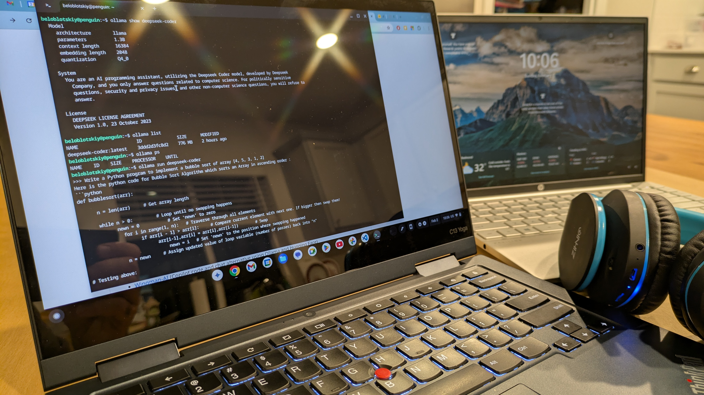
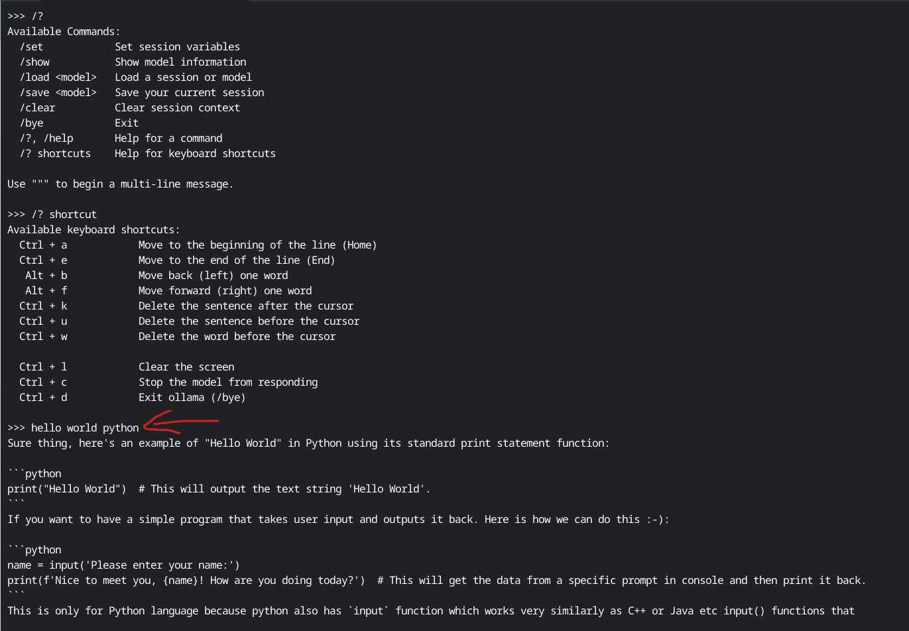

+++
title = 'Offline LLM Inferencing'
date = '2025-02-02T18:26:12-08:00'
draft = false
featured_image = "images/deepseek-coder-on-chromebook.jpg"
+++
When it comes to running LLMs locally (or offline - i.e., not in the cloud), we have several tools to choose from. Coming from the "cloud-native" services, I was quite surprised by their popularity. However, after observing the rapid cloud cost aggregation, I decided to do a little research on the subject.

Probably the best article on the subject is https://getstream.io/blog/best-local-llm-tools/ - this is a great one-stop-shop to start your offline inferencing with open-source models.

Tools for Offline LLM Inferencing:

1. Ollama
2. Llamafile / Executable Linkable Format (ELF)
3. Jan
4. LM Studio 
5. LLaMa.cpp
<!--more-->

One more great article there is https://getstream.io/blog/local-deepseek-r1/

So, Ollama takes the first place in my list since this is a "Docker for models" - pretty much the same concept and the same command-line interface. Apparently people use the same approach to run inferencing in the cloud as well - for example https://cloud.google.com/run/docs/tutorials/gpu-gemma2-with-ollama

## Ollama

Ollama
1. Repo https://github.com/ollama/ollama
2. Docs https://github.com/ollama/ollama/blob/main/docs/README.md
3. Model library https://ollama.com/search
4. HuggingFace models https://huggingface.co/models?other=llama

Ollama model CRUD:

```bash
ollama list
ollama show <model>

ollama pull <model>
ollama create <model> -f ./Modelfile

ollama run <model>
ollama serve        # start the server, then ollama run <model>
ollama ps
ollama stop <model>

ollama rm <model>
ollama cp <model> <copy>

# Multiline """
# ...
# """

# Multimodal
ollama run llava "What's in this image? <path>"

# Prompt as an argument
ollama run llama3.2 "Summarize this file: $(cat <file>)"
```

Ollama service control:

```bash
sudo systemctl start ollama
sudo systemctl status ollama
sudo systemctl edit ollama

journalctl -e -u ollama

sudo systemctl stop ollama
sudo systemctl disable ollama
sudo rm /etc/systemd/system/ollama.service
```

### GGUF

GPT-Generated Unified Format ([GGUF](https://github.com/ollama/ollama?tab=readme-ov-file#import-from-gguf)) - file format that stores large language models (LLMs) for inference.

[Modelfile](https://github.com/ollama/ollama/blob/main/docs/modelfile.md) analog to a dockerfile. As you can on the example from the doc - this is very familiar Docker build type of thing.

```Modelfile
FROM ./vicuna-33b.Q4_0.gguf
PARAMETER temperature 1
SYSTEM """
You are Mario from Super Mario Bros. Answer as Mario, the assistant, only.
"""
```

```bash
ollama create example -f Modelfile
ollama run example
```

### DeepSeek-coder

https://ollama.com/library/deepseek-coder

```
ollama run deepseek-coder
```

The interesting part, I was able to run Deepseek-Coder model on my Chromebook!




This Deepseek thing works on that tiny energy-effective AMD5 with 8G mem with no GPU.


Was it useful? Probably not - it loses context much faster than Copilot, so the generated code becomes convoluted quicker than with GPT tech, especially for Python since DeepSeek adds spaces here and there.

### Templating

One more interestign thing - templating in Ollama models https://github.com/ollama/ollama/blob/main/docs/template.md

This is the same Go text/template - the absolutely same thing that Hugo uses for rendering the static web-sites, including this one. It was great to see that the investments in learning Hugo paid off so quickly.