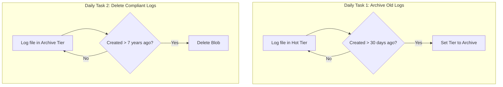
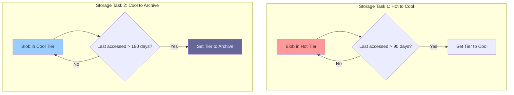
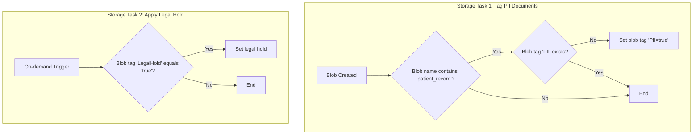
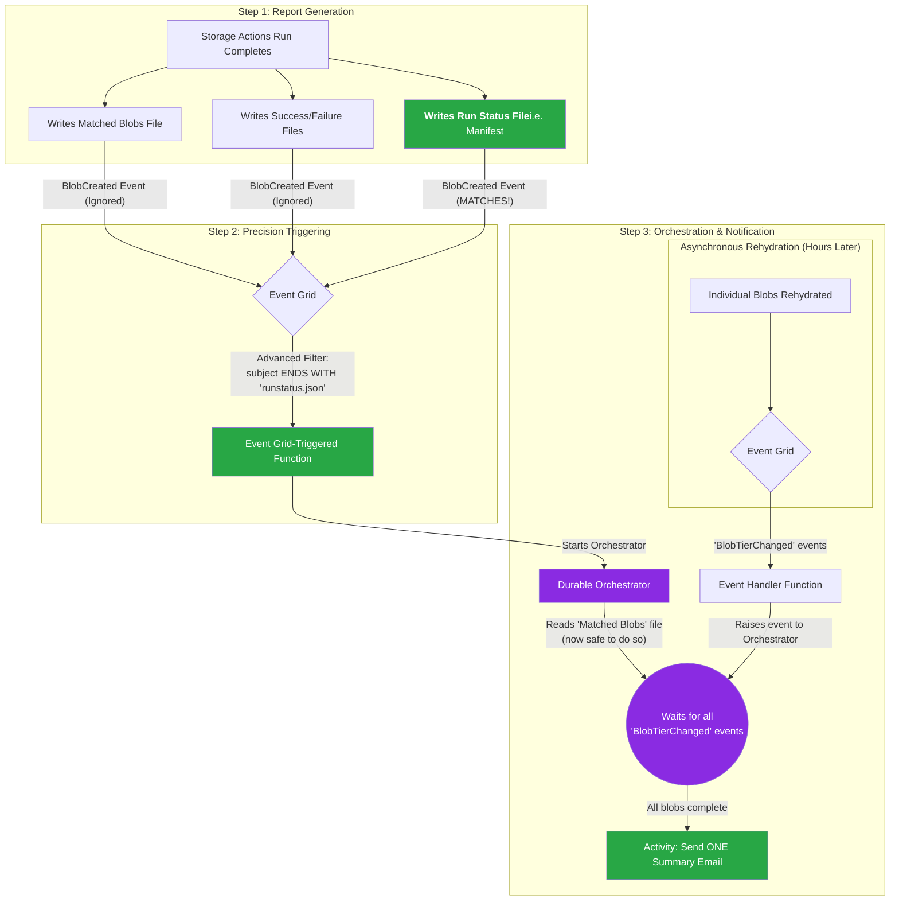

+++
date = '2025-10-05T20:01:03-08:00'
draft = false
title = 'Automating the Data Deluge: Four Real-World Architectures with Azure Storage Actions'
tags = ['engineering', 'azure', 'storage']
+++

Managing data at scale is one of the biggest challenges in modern cloud architecture. As data volumes grow from terabytes to petabytes, manual operations become impossible, and simple scripts become brittle and insecure. [Azure Storage Actions](https://learn.microsoft.com/en-us/azure/storage-actions/storage-tasks/), a serverless framework for automating data management in Azure Storage, offers a powerful solution. It provides a no-code, scalable, and secure way to handle operations like lifecycle management, data organization, and policy enforcement across billions of objects.
<!--more-->

This post dives deep into four practical, real-world use cases, exploring their architecture, operational challenges, and the powerful patterns you can apply to your own data governance and management strategies.

The GitHub repo is [here](https://github.com/belablotski/azure-sa)

### The Four Use Cases at a Glance

| Use Case | Primary Goal | Key Challenge |
| :--- | :--- | :--- |
| **[1. Log Archiving & Deletion](https://github.com/belablotski/azure-sa/blob/main/use-cases/log-archiving-for-compliance.md)** | Automate long-term retention and deletion for compliance. | Ensuring consistent policy application and cost-effective storage over many years. |
| **[2. Media Lifecycle Management](https://github.com/belablotski/azure-sa/blob/main/use-cases/media-lifecycle-management.md)** | Optimize storage costs for a massive media library. | Automatically tiering large files from Hot to Cool to Archive based on access patterns. |
| **[3. Data Governance Enforcement](https://github.com/belablotski/azure-sa/blob/main/use-cases/data-governance-with-blob-tags.md)** | Proactively tag sensitive data and manage legal holds. | Applying consistent governance rules in near real-time without impacting performance. |
| **[4. On-Demand Data Hydration](https://github.com/belablotski/azure-sa/blob/main/use-cases/data-hydration-for-analytics.md)** | Provide secure, self-service data retrieval from Archive for analytics. | Managing the high cost and latency of Archive retrieval and notifying users upon completion. |

---

## Four Real-World Architectures with Azure Storage Actions

### 1. Automated Log Archiving for Compliance

Complete solution is [here](https://github.com/belablotski/azure-sa/blob/main/use-cases/log-archiving-for-compliance.md).

**The Scenario:** A financial services company is required to retain application logs for a specific period (e.g., 30 days) in hot storage for immediate analysis, then archive them for a long-term compliance period (e.g., 7 years), and finally delete them permanently.

**The Solution:** This is a classic lifecycle management problem, perfectly suited for a pair of simple, scheduled Storage Tasks.
*   **Task 1 (Archive):** A daily task checks for any log files older than 30 days in the Hot tier and moves them to the cost-effective Archive tier.
*   **Task 2 (Delete):** A second daily task scans the Archive tier for logs older than 7 years and permanently deletes them.

This "set and forget" model ensures compliance and cost optimization without any manual intervention.

**Architecture Diagram:**

---

### 2. Data Lifecycle Management for a Media Company

Complete solution is [here](https://github.com/belablotski/azure-sa/blob/main/use-cases/media-lifecycle-management.md)

**The Scenario:** A media company has a massive library of large video files. New and popular content is accessed frequently, but viewership drops off over time. They need to reduce storage costs by moving less popular assets to cheaper storage tiers.

**The Solution:** This use case is similar to log archiving but is based on access patterns rather than creation time. Two scheduled tasks work in tandem to manage the data lifecycle.
*   **Task 1 (Hot to Cool):** A weekly task checks for video files in the Hot tier that haven't been accessed in the last 90 days and moves them to the Cool tier.
*   **Task 2 (Cool to Archive):** Another weekly task checks for files in the Cool tier that haven't been accessed in 180 days and moves them to the offline Archive tier for long-term preservation.

**Architecture Diagram:**

---

### 3. Enforcing Data Governance with Blob Tags

Complete solution is [here](https://github.com/belablotski/azure-sa/blob/main/use-cases/data-governance-with-blob-tags.md).

**The Scenario:** A healthcare organization needs to ensure that all patient records containing personally identifiable information (PII) are correctly tagged for compliance. They also need the ability to place specific documents under a legal hold to prevent deletion.

**The Solution:** This is a proactive governance scenario.
*   **Task 1 (Tag PII):** A recurring daily task scans for any blobs whose names suggest they are patient records (e.g., name contains `patient_record`) but which are missing a `PII` tag. If it finds any, it automatically applies the tag `PII = true`. This task is idempotent, meaning it's safe to run repeatedly.
*   **Task 2 (Apply Legal Hold):** A second, on-demand task is used by the legal team. When they need to preserve a set of documents, they first tag them with `LegalHold = true`. They then trigger this task, which finds the tagged blobs and applies an indefinite legal hold, making them immutable.

**Architecture Diagram:**

---

### 4. On-Demand Data Hydration for Analytics

Complete solution is [here](https://github.com/belablotski/azure-sa/blob/main/use-cases/data-hydration-for-analytics.md).

**The Scenario:** An analytics team needs a secure, self-service way to retrieve specific historical data from the low-cost Archive tier for short-term analysis. The main challenges are the high cost and long latency (up to 15 hours) of archive retrieval, and the need to notify the user only when their *entire* dataset is ready.

**The Solution:** This is the most complex architecture, combining a manual user action, a controlled on-demand task, and a sophisticated event-driven orchestration for tracking.
1.  **Self-Service Tagging:** The analyst applies a specific blob index tag (e.g., `rehydrate-for-project=q4-2025-ml-training`) to the archived files they need. They are granted permissions to *only* write this specific tag via a custom RBAC role with an ABAC condition.
2.  **Controlled Trigger:** A privileged operator or an automated approval workflow (e.g., via a Logic App) enables a single-run Storage Task. The task finds all blobs with the specific tag and initiates the asynchronous rehydration to the Hot tier.
3.  **Stateful Tracking & Notification:** The Storage Actions execution report **is not** a "data is ready" notification. A **Durable Functions orchestrator** is triggered when the report is created. It reads the report to get the list of all blobs being rehydrated, then waits for `BlobTierChanged` events from Event Grid for each blob. Only when all blobs are confirmed as "Hot" does it send a single, consolidated email to the user.

**Architecture Diagram:**

---

## The Bigger Picture: Is Azure Storage Actions Right for You?

Across these four diverse scenarios, a clear pattern emerges. Azure Storage Actions excels as a centralized, policy-driven engine for **scheduled, large-scale data management**. Its core strengths lie in its serverless nature, robust security model with Managed Identities, detailed auditability through execution reports, and its seamless integration with Infrastructure as Code (IaC) for reliable, repeatable deployments.

However, it's not a one-size-fits-all solution. The key considerations are:

*   **It is not a real-time service.** For actions that must trigger within seconds of an event, Azure Event Grid and Functions remain the superior choice. Storage Actions is for batch processing on a schedule (daily, weekly, or on-demand).
*   **Change management requires automation.** The fact that task updates must be propagated by deleting and recreating assignments makes an IaC approach almost mandatory for any production environment.
*   **Feature gaps can dictate architecture.** The current inability to *write* blob metadata (only read it) is a critical limitation for governance on ADLS Gen2 accounts, forcing a reliance on standard blob storage with index tags for certain patterns.

### The Conclusion

Azure Storage Actions is an invaluable tool for any organization managing petabytes of data in Azure. It is the ideal solution for implementing consistent, auditable, and cost-effective data lifecycle and governance policies at scale. By embracing its declarative, policy-based model and integrating it with IaC for management and event-driven services for complex orchestration (like user notifications), you can build powerful, enterprise-grade data management solutions that are both secure and operationally efficient.