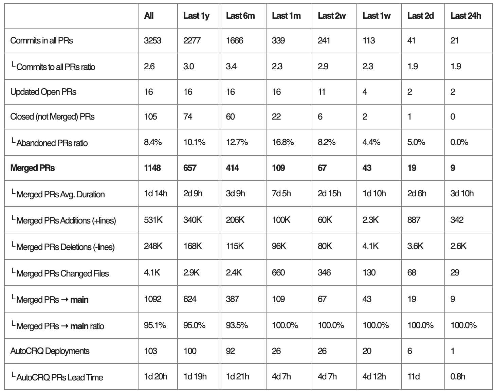

+++
date = '2025-01-24T23:01:20-08:00'
draft = true
title = 'Engineering excellence metrics'
+++

1. Commits in all PRs
    1. Commits to all PRs ratio
2. Updated Open PRs
3. Closed (not Merged) PRs
    1. Abandoned PRs ratio
4. Merged PRs
    1. Merged PRs Avg. Duration
    2. Merged PRs Additions (+lines)
    3. Merged PRs Deletions (-lines)
    4. Merged PRs Changed Files
    5. Merged PRs → main
    6. Merged PRs → main ratio
5. AutoCRQ Deployments
    1. AutoCRQ PRs Lead Time

