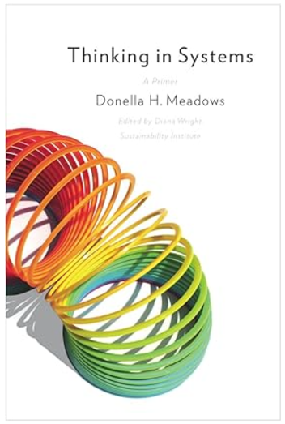

+++
date = '2024-01-07T19:45:46-08:00'
draft = false
title = 'Thinking in Systems'
description = 'by Donella Meadows'
featured_image = 'thinking_in_systems.png'
tags = ['Book']
+++
Systems thinking is essential for addressing complex challenges: understanding system dynamics is crucial for developing effective and sustainable solutions to environmental, social, and economic problems.

<!--more-->

My takeaways from Donella Meadows' "Thinking in Systems":

1. Systems Thinking: This emphasizes understanding the interconnectedness of elements within a whole. It encourages looking beyond individual parts to see how they interact and influence each other.
2. Stocks and Flows: Stocks are the accumulations within a system (e.g., population, water in a reservoir). Flows are the rates of change into and out of those stocks.
    * There is also a concept of Environment, which is finite. Or we choose our limits (self-imposed limits) that environment can support, either some balancing process will emerge to limit the growth (system-imposed limit).
3. Feedback Loops: These are circular chains of cause and effect, they drive system behavior.
    * Positive (or Reinforcing) Feedback Loops: Amplify change, leading to exponential growth or decline. (e.g., compound interest, viral spread)
    * Negative (or Balancing) Feedback Loops: Resist change, seeking stability. (e.g., thermostat, predator-prey dynamics)
4. Delays: Time lags between actions and their consequences can lead to unintended and sometimes disastrous outcomes.
    * Delays can cause instability: Time lags in feedback loops can lead to oscillations, overshoots, and unintended consequences.
5. Leverage Points: These are places within a system where a small intervention can produce significant and lasting change.
    * Identifying and influencing key points within a system, such as rules, information flows, and paradigms, can have a significant impact on system behavior.

I highly recommend this book! It provides a framework of simple abstractions that will help you understand and predict how systems behave. And it's applicable everywhere, even much beyond the software engineering.