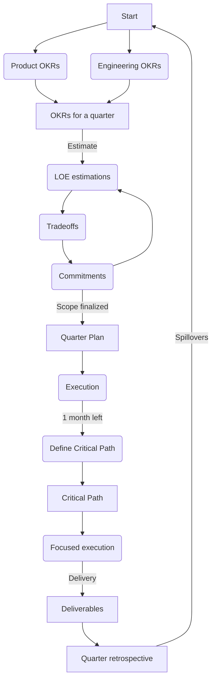

+++
date = '2025-02-07T17:50:07-08:00'
draft = false
title = 'Week 6 of the year 2025'
tags = ['management']
+++
This Week's Challenges: 
- [FY25Q4 retrospective (Management)]()
<!--more-->

## FY25Q4 retrospective (Management) {#q4-retro}

This week we ran a retrospective meeting for Q4 (Nov, Dec, Jan) - the meeting happens in the group settings and its purpose is to get team members on the same page when it comes to our group deliverables. Also, this is the best time to discuss JIRA and code stats.

Basically, my quarterly execution process is pretty straightforward.

Ok, it's not so straightforward as I expected before writing it down, but still.. We've just closed the quarter, so it's time to retrospect it.

I typically prepare a retrospective document to discuss it with the team. It contains 3 sections:

1. Group deliverables scheduled for this quarter (list of OKRs and the "critical path" doc).
2. JIRA statistics
3. Code statistics

### Group deliverables

They are coming from OKRs list and the critical path doc. The structure of a critical path document:

1. Objective
2. Key Results
3. Owner (tech lead)
4. Link to JIRA Epic
5. End-of-quarter status (delivered, cancelled, spillover)
6. Original LOE estimation (in sprints)
7. Factual amount of work (in sprints)

The key points to cover here:

1. Status (what and why, and how much time will it take to come back on track in case of spillovers).
2. LOE estimations vs factual efforts.
3. Group's rate of OKR completion (number of completed OKRs / all OKRs).

### JIRA statistics
I have a Tableau report that pulls and visualizes JIRA statistics at the level of an individual engineer. The metrics here are:

1. Number of JIRA tickets
2. Sprints * Tickets
3. Number of tickets closed in sprints (as planned)
4. Number of spillovers (tickets moved to the next sprint)
5. "Closed in sprint ratio" - number of tickets closed on time / all tickets assigned to a person
6. Story points
7. Average ticket complexity (average number of story points per ticket)

To support this it typically makes sense to attach a list of stories in a form of JIRA query results - basically filter all the stories thos belong to the epics on that the team worked on through the quarter.

### Code statistics

The metrics I collect for the retrospective meeting:

1. Number of PRs merged in "main" branch
2. Number of abandoned PRs
3. PR duration for merged PRs
4. Number of deployments
5. PR lead time

That's pretty much it - that's the write-up for a quarterly retrospective meeting.

One more thing here - all these statistics (deliverables and performance in JIRA and in code repos) is a foundation for the quarterly feedback sessions, which I run in my team. This makes quarterly feedback delivery much easier and more focused on a particular individual. Since everybody already knows group results, the quarterly review becomes its personalized version, where we're talking of contributions of every single engineer into the success of the team.

See also:
- [Quarterly Planning Process]()
- [Engineering Excellence Metrics]()