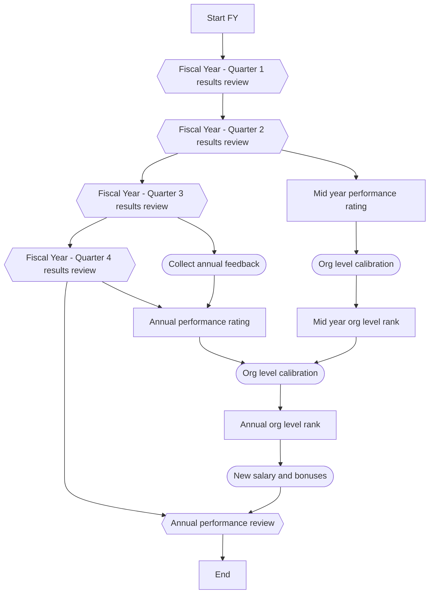

+++
date = '2025-02-16T21:37:07-08:00'
draft = false
title = 'Week 7 of the year 2025'
tags = ['management']
+++
This Week's Challenges: 
- [Annual Performance Review (Management)]()
<!--more-->

## Annual Performance Review (Management) {#annual-perf-review}

In my performance management process, the annual review is the very last step, so it's usually easier than typical performance reviews that most managers do. The reason for this is the quarterly results reviews, which we perform every three months with my direct reports. And the annual review happens in 2-4 weeks after the Q4 review, so all these topics are pretty fresh in the receiver's memory and in mine as well.

The hexagon shapes (feedbacks on quarterly results and the annual review) symbolize the process where I'm talking to team members whom I directly support. The rest of the processes happen on the managers' side.

### Annual performance review write-up
Typically, I prepare a detailed document for each of my direct reports that summarizes Q1-Q4 reviews, peer feedback, impact, etc. The structure of the performance review:

1. Deliverables (throughout the entire year)
2. Other achievements (besides deliverables, e.g., hackathon participation, cost cuts, innovations, etc.)
3. Summary of peers' feedback (2-3 positive points and 2-3 proposed improvements)
4. Summary of my feedback (based on Q1-Q4 reviews)
5. Strong sides (list with supporting examples)
6. Areas to improve (list with supporting examples)
7. Some final thoughts about expectations from the level and career progression (especially for the folks who were bouncing in "above expectations" - "exemplary" buckets throughout the year - this is a perfect sign of an upcoming promotion)

After walking through the performance review doc, we're coming to the bonuses and salary point.
This part I start from the final annual rating. From this point, we're following the official company process where I should communicate that rating to a subordinate and explain how it will affect their financial situation.
So, the steps here:

1. Start with the current salary. Cover merit (typically 0%-5%). Show the new salary.
2. Cash bonus - explain the planned bonus (typically 15-20%) and its performance multiplier based on the annual results (typically 0x-1.5x). Calculate it and show the plain number.
3. Total cash = Current salary + Cash bonus
3. Stocks - explain the planned amount (20k-100k) and its performance multiplies (0x-1.7x). Calculate it and show the number.
4. Total compensation for the fiscal year = Total cash + Stoks

And now is the very important part of the performance review - congratulate the guy with a successful year! Scroll to the very top of the doc (to the deliverables and achievements) and establish a clear connection between the amount of contribution and the reward.

And that's it - make it special to the receiver. Celebrate it. 

P.S. One more thing - it will be their homework to prepare for goal setting for the next year based on their stron sides and areas to improve in this document.

See also:
- [Quarterly Planning Process]()