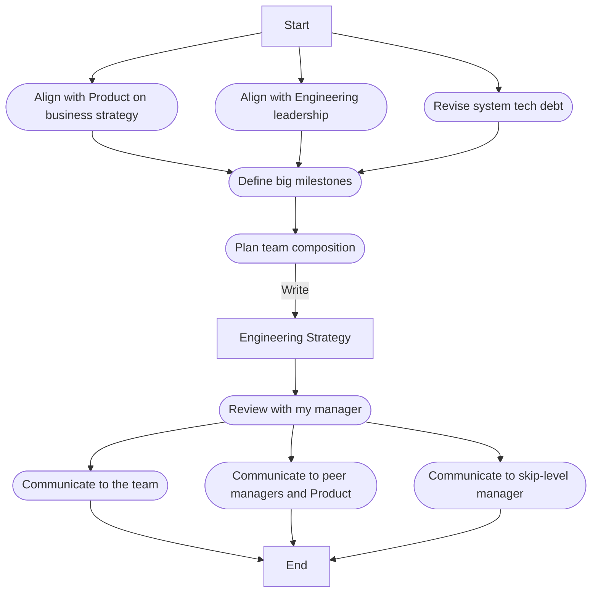

+++
date = '2025-02-23T19:30:00-08:00'
draft = false
title = 'Week 8 of the year 2025'
tags = ['management']
+++
This Week's Challenges: 
- [Engineering strategy for FY26 (Management)]()
<!--more-->

## Engineering strategy for FY26 (Management) {#engg-strategy}

This week's challenge was writing an engineering strategy document for my group. It is probably more accurate to say revising, since this is an annual update of the existing documents. It is worth noting that this is not a list of deliverables for a fiscal year, but a general direction where the team is headed (with the next level of details, such as milestones).

This strategizing activity is all about getting people on the same page. It focuses on:

1. Alignment
2. Focus
3. Accountability (as a logical product of 1 and 2)

My approach to building the engineering strategy is in the diagram below.

### Engineering strategy document

In my opinion, a good strategy document should be a one-pager with 4-5 key areas and what exactly we're going to do there. The template I have used for the last couple of years is basically a nested list with the 5 topmost elements:

1. The System
    - The "big rocks" we're moving. Since I'm in real-time ads targeting, this is all about the real-time advertising platform the team builds.
2. The Integrations
    - How our system is connected to the rest of the advertising ecosystem and to external partners.
3. The Tech
    - Our priorities in building and maintaining our tech stack. For example, we're striving to reduce the total cost of ownership (TCO) of the system, and to achieve that we're moving our high-load services that require low latency event processing from Scala to Go language.
4. The Dev Process
    - The team's priorities in improving the engineering process itself. For example, continuing to use the Engineering Excellence practices to measure the efficiency of the dev pipeline, continuing to use Operational Excellence practices to keep our quality of service (QoS) and cost under control, and using more AI-generated code with GitHub Copilot (and figuring out a way to measure this as part of EE).
5. The Team
    - The desired team composition with a list of new roles to be hired.

These 5 items will be a "one-pager" engineering strategy doc. To support this, I typically add 3 tables at the end of the document: milestones, timeline, and ideas.

Speaking of milestones:

|Milestore  |Category|Engineering pod     |Target date|Comments|
|-----------|--------|--------------------|-----------|--------|
|Milestone 1|Product |Real-time data plane|...        |...     |
|Milestone 2|Tech    |Control plane       |...        |...     |

Then tentative timeline (basically waterfall-ish work process detailing):

|Initiative|FY26Q1|FY26Q2|FY26Q3|FY26Q4|FY27Q1|FY27Q2|FY27Q3|FY27Q4|FY28Q1|
|----------|------|------|------|------|------|------|------|------|------|
|Init. 1   |...   |...   |      |      |      |      |      |      |      |
|          |      |...   |...   |...   |      |      |      |      |      |
|          |      |      |      |...   |...   |...   |...   |      |      |
|          |      |      |      |      |      |      |...   |...   |...   |

As you can see, my strategy covers a list of anticipated changes for the next two years in a simple quarterly-based waterfall format.

And the final part is "ideas" - basically, this is the list of something that I can't incorporate into the engineering strategy per se, but I'd like to keep an eye on the thing and track how it reveals in the future.

|Idea|Description|Comments|
|----|-----------|--------|
|... |...        |...     |

See also:
- [Engineering Excellence Metrics]()
- [PR lifecycle]()
- [Quarterly Planning Process]()