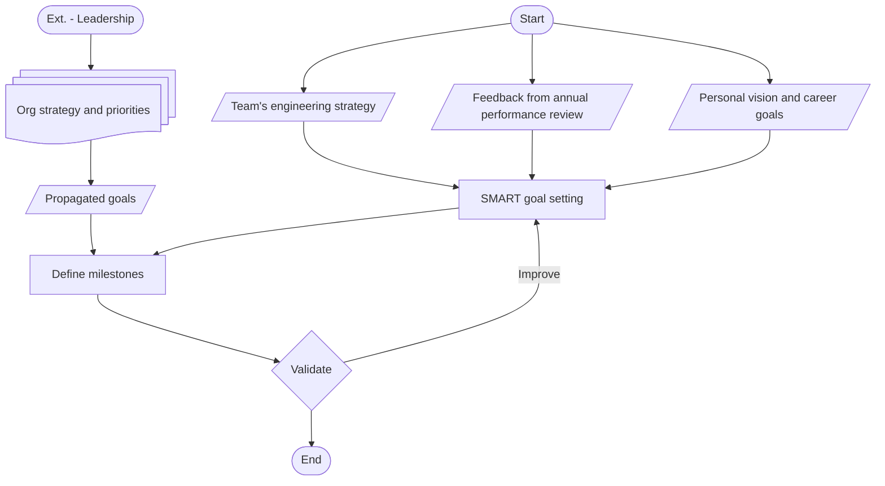

+++
date = '2025-03-02T18:15:00-08:00'
draft = false
title = 'Week 9 of the year 2025'
tags = ['management']
+++
This Week's Challenges: 
- [Setting individual goals for FY26 (Management)]()
<!--more-->

## Setting individual goals for FY26 (Management) {#goals-setting}

Last week I wrote about [Engineering strategy for FY26 (Management)](), the logical next step here is to help the directs internalize it by setting individual goals for the fiscal year.

Yet again, it's all about alignment, focus, and accountability. We're working on the goal settings in our one-on-one meetings (and typically it takes 2-3 consecutive weeks to get it done across the board).

The first step is to ask the people to read the strategy doc and start defining their SMART goals. SMART is a great framework to insure that objectives that are specific, measurable, achievable, relevant, and time-bound.

The goal setting process:

Some ideas about the input of the process:
1. Big deliverables planned for the team.
2. Quarterly feedback docs and the annual performance review doc.
3. Gaps in skills if any. Desirable skills.
4. Industry trends and innovations.

See also:
- [Engineering strategy for FY26 (Management)]()
- [Annual Performance Review (Management)]()
- [Quarterly Planning Process]()