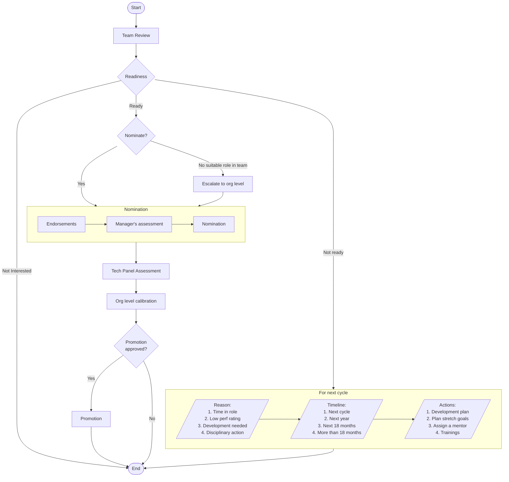

+++
date = '2025-03-02T18:15:00-08:00'
draft = false
title = 'Week 9 of the year 2025'
tags = ['management']
+++
This Week's Challenges: 
- [Promotion nominations (Management)]()
<!--more-->

## Promotion nominations (Management) {#promo}

This week was designated to finish promotion nominations. There are a couple of interesting points:

1. All team members should be assessed for their readyness for promotion. This step is called a team review.
2. People who are ready, should be nominated.

The promotion nomination process:

See also:
- [Annual Performance Review (Management)]()