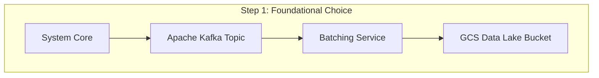
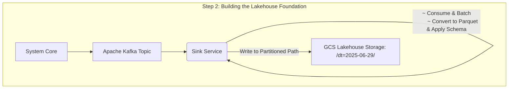
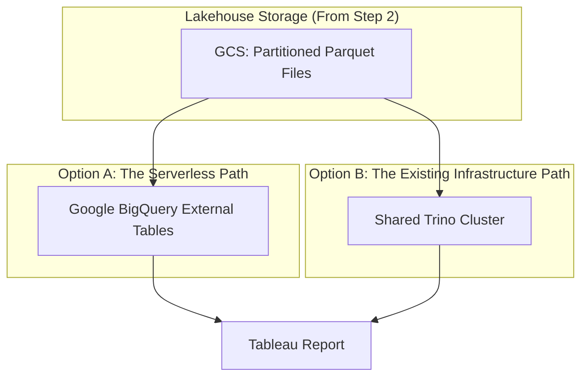
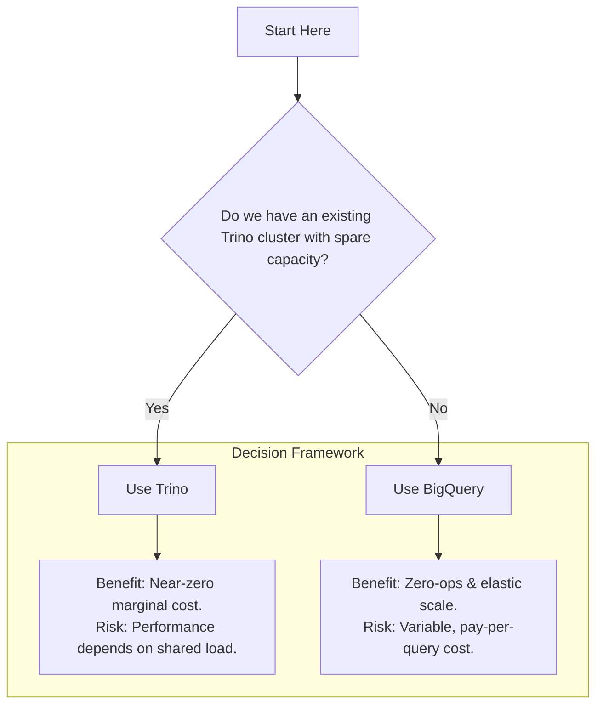

+++
date = '2025-06-20T19:41:00-08:00'
draft = false
title = 'Week 26 of the year 2025'
tags = ['engineering', 'architecture']
+++
This Week's Challenges: 
- [From Kafka events to Tableau reports: A 3-Step Funnel to a Cost-Effective Analytics Architecture]()
<!--more-->

## From Kafka events to Tableau reports: A 3-Step Funnel to a Cost-Effective Analytics Architecture {#lakehouse}

You have a stream of valuable data flowing through Kafka. You know there are business-critical insights locked inside, and your goal is to get them into a Tableau dashboard. The challenge? Doing it without an enterprise-sized budget.

Many teams get stuck here, fearing that building a real-time analytics pipeline will be complex and expensive. But by making a few smart, strategic decisions upfront, you can build a powerful, scalable, and surprisingly cost-effective platform on serverless Google Cloud Platform (GCP) or org-hosted shared Apache Trino cluster.

This guide will walk you through a 3-step decision funnel, narrowing down the options at each stage to arrive at an optimal architecture for your specific needs.

### Step 1: The Foundation - Choosing Your Data's Home

Your first decision is the most important for cost control: where will all this data live? The events from Kafka are arriving 24/7. You can't afford to put them all into a high-performance, expensive database.

This leads to our first architectural decision: we will build a **Data Lake**. Instead of a structured database, we'll use a cheap, durable, and scalable object store as the primary home for our data.

On GCP, the clear winner is **Google Cloud Storage (GCS)**.

  * **Why GCS?** It's incredibly cheap for data at rest (pennies per GB/month), it's highly durable, and it's the foundation upon which the entire GCP data ecosystem is built. Storing data here first gives us maximum flexibility later.

This decision immediately simplifies our initial data flow. We need a service that can consume from Kafka and write to GCS.

We've now established our cheap storage foundation. But just dumping the data isn't enough. *How* we store it is the key to unlocking performance and savings (hey! we're serious about [EDLP](https://en.wikipedia.org/wiki/Everyday_low_price) here!).

### Step 2: The Optimization - From Data Lake to Lakehouse

Simply writing millions of small, raw JSON files from Kafka into GCS is a recipe for disaster. While storage will be cheap, any attempt to query it will be painfully slow and expensive. This is how a Data Lake becomes a dreaded "Data Swamp"—a repository of untrustworthy, unorganized, and unusable data.

To avoid this, we must be intentional. This is where we elevate our architecture from a simple Data Lake to a more advanced **Lakehouse**.

#### My Thinking: Why the Lakehouse is a Game Changer

A Lakehouse isn't just a buzzword; it's a new architectural paradigm that brings the reliability, data management, and performance features of a traditional Data Warehouse directly to the low-cost, flexible storage of a Data Lake. The core idea is to impose structure and transactional guarantees on your data right where it lives in GCS.

This is achieved by implementing a few key optimizations:

1.  **Use a Columnar Format: Apache Parquet.** This is the first step. Don't store raw JSON. Convert your structured events into Parquet files. Parquet is **columnar**, meaning if your query only needs 3 columns out of 50, a query engine will only read the data for those 3 columns. This single change dramatically reduces the amount of data scanned and, therefore, the query cost.

2.  **Organize with Hive Partitioning.** Organize your Parquet files in GCS using date-based folders (e.g., `/dt=2025-06-29/`). This allows query engines to perform "partition pruning"—if you query for yesterday's data, the engine won't even look at the files from any other day, providing another massive boost to performance and cost savings.

3.  **Adopt an Open Table Format.** To truly achieve Lakehouse capabilities like ACID transactions (making sure your data writes either fully succeed or fail), time-travel (querying data as it looked at a specific point in time), and schema enforcement, you would adopt an open table format like **Apache Iceberg**. These formats act as a metadata layer on top of your Parquet files, bringing data warehouse-like reliability to your GCS data. While a deeper topic, our choice of Parquet and partitioning is the essential prerequisite for this evolution.

By taking these steps, you are no longer just "dumping" data. You are curating a reliable, high-performance, single source of truth that can power everything from BI dashboards in Tableau to AI/ML model training, all from the same copy of the data.

Our refined architecture now reflects this intelligent data management approach. For the service itself, we'll choose a serverless option like **Cloud Run** to ensure we're not paying for compute when no messages are being processed.

With our data stored cheaply *and* intelligently in a Lakehouse foundation, we're ready for the final step: querying.

### Step 3: The Query Engine - The Final Showdown

Our data is in GCS, optimized and ready. Now, how do we run SQL on it to power our Tableau reports? We need a query engine that can read data directly from our Lakehouse.

This brings us to the final decision point, a head-to-head comparison between two excellent options.

Let's break down the trade-offs.

#### Option A: Google BigQuery (via External Tables)

BigQuery can query data directly in GCS without loading it first. This is a serverless, fully managed solution.

  * **Cost Model: Pay-per-query.** You pay a fee for every terabyte of data your SQL query scans. If you don't run queries, you pay nothing.
  * **Management: Zero.** It's Google's problem. There are no clusters to manage, patch, or tune. It just works.
  * **Performance: Elastic & Consistent.** If 100 users hit "refresh" on a report simultaneously, BigQuery scales automatically to handle the load. Performance is excellent and isolated from other workloads.

#### Option B: An Existing Shared Trino Cluster

Your organization already has a Trino (formerly Presto) cluster running 24/7 for other reporting scenarios.

  * **Cost Model: Fixed Infrastructure.** The cluster is already paid for. From your project's budget perspective, the marginal cost of running another query is effectively zero.
  * **Management: Org-Managed.** Your platform team runs the cluster. You are dependent on them for uptime, configuration, and performance tuning.
  * **Performance: Fixed & Shared.** Your report's performance is tied to the overall cluster load. It can be fast, but it's vulnerable to "noisy neighbors"—a heavy query from another team can slow your reports down.

### Conclusion: Making the Final Call

We've funneled our choices down from a wide range of possibilities to two excellent final contenders. So, which path should you take?

The answer isn't purely technical; it's based on your organization's context and priorities. Here is a simple framework to make the final decision.

**Choose your existing Trino Cluster if:**

  * Your number one priority is minimizing **new, direct project costs**.
  * You've confirmed the shared cluster has **ample spare capacity**.
  * Your reporting workload is **predictable and stable**.
  * Your organization has a **strong platform team** and in-house Trino expertise.

**Choose Google BigQuery if:**

  * Your priority is **developer velocity and zero operational overhead**.
  * Your reporting workload is **bursty, unpredictable, or needs to scale on demand**.
  * You need **clear cost attribution** for your project's usage.
  * You want a solution that is tightly integrated with the rest of the GCP ecosystem.

By following this funnel, you've systematically designed an architecture that is not only powerful but also consciously cost-effective, elevating a simple storage plan into a reliable and performant Lakehouse ready for any analytical challenge.

Thank you for reading. Happy coding!