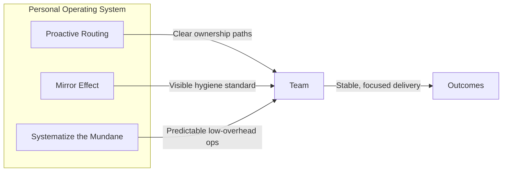

+++
date = '2026-06-29T10:00:00-08:00'
draft = false
title = 'Week 27 of the year 2026'
tags = ['management']
+++
This Week's Challenges:
- [The Systems-Level Manager: Engineering Predictability in Ambiguous Environments]()

<!--more-->

## The Systems-Level Manager: Engineering Predictability in Ambiguous Environments {#systems-manager}

### The Ceiling of "Management by Instinct"

Years of software development teach you a powerful set of instincts. You can look at a system architecture and sense where the bottlenecks will form. You can read a pull request and feel whether the abstraction is right. When you step into a management role, those instincts don't disappear — they become your first management toolkit. You use them to unblock engineers, to cut through ambiguous requirements, to fight fires. A lot of fires.

For a while, that works. Then you hit a ceiling.

The teams grow more senior. The technical surface area widens. The organizational environment shifts faster than any single person can track. At some point I realized that my instincts, however sharp, were a finite resource. I was making dozens of small decisions a day on feel — who to delegate to, which escalation deserved my time, how to frame a status update — and the cumulative cost of that ad-hoc decision-making was showing up as inconsistency. Some weeks were excellent; others were a bit chaotic.

The breakthrough was recognizing that I wasn't just managing a system — I needed to *engineer* the way I managed. The output of that realization was what I now call a Personal Operating System (PSOS): a set of deliberate, predictable routines that replace ad-hoc decision-making with reliable, repeatable behaviors.

### Leading the "Misfit Crew" Through the Fog

There is a well-worn cinematic trope: the team of brilliant, highly specialized misfits who, despite their obvious collective capability, need someone to forge them into a unified force. The reality of leading a group of senior and principal engineers is not so different. Each person has deep expertise in their own domain — one is the authority on distributed systems throughput, another owns the intricacies of a complex API contract, a third is the institutional memory for a decade of architectural decisions. The diversity is a strength. The alignment is the challenge.

The fog comes from ambiguity. Cloud infrastructure features rarely arrive with perfectly written specifications. API contracts shift during negotiation. Priorities realign to match organizational headwinds. When requirements are murky, engineers with strong opinions — and they should have strong opinions — can pull in different directions without any malicious intent. They are simply filling the vacuum that ambiguity creates.

This is the first place where the manager's operating system becomes essential. If clarity cannot come from the product or the stakeholders fast enough, it must come from the team's operating model. A predictable process — how decisions are made, how ambiguity is escalated versus resolved locally, how work is sequenced — becomes the substitute for requirements that haven't been written yet. The team navigates the fog not because someone has a map, but because everyone knows the compass bearing.

### Core Modules of my Operating System

The PSOS is not a productivity system. It is not a to-do list methodology. It is a small set of principles that, when applied consistently, create a stable foundation for the team to build on.

#### Proactive Routing

The most expensive delegation is reactive delegation — waiting until a task is on fire before assigning it. By that point, there is no room for ownership; there is only rescue. Proactive routing means building pathways *before* work arrives.

In practice, this means regularly asking: which engineer on the team is best positioned — in terms of growth trajectory, current context, and available bandwidth — to take natural ownership of the next wave of ambiguous work? Then creating that connection before the work is formally defined. When the feature eventually lands, it doesn't need to be delegated; it gravitates toward the person who has already been thinking about it.

This is less about task assignment and more about shaping the environment so that the right kind of work finds the right person without a bottleneck forming at the manager's desk.

#### The Mirror Effect

A team will tend to reflect the organizational hygiene of its manager. This is not a motivational platitude — it is a structural observation. If status updates are vague, the team's written communication will drift toward vagueness. If commitments are tracked loosely, the team's sprint hygiene will loosen. If cross-team alignment conversations happen only when a deadline is in crisis, that is the pattern the team will internalize as normal.

The inverse is equally true. When a manager's own tracking, communication, and follow-through are consistent and visible, that standard becomes ambient. Engineers do not need to be told to write clear commit messages when they see that clarity is the operating norm everywhere above them.

This is why personal organizational hygiene is not a personal productivity matter. It is a management lever.

#### Systematizing the Mundane

There is a category of management work that is repetitive, necessary, and cognitively expensive when handled ad-hoc: weekly syncs, status summaries, cross-team alignment touchpoints, escalation reviews. Every instance of this work processed as a one-off consumes decision-making bandwidth that could go toward strategy.

The approach I have found most effective is to turn as much of this as possible into a predictable, low-friction routine. The weekly team sync has a standing agenda. The status update follows a fixed template. The cross-team alignment meeting has a defined cadence and a pre-agreed scope. None of this is glamorous. All of it accumulates into a significant savings of cognitive load over the course of a quarter.

The goal is to reserve your sharpest thinking for the problems that genuinely require it, and to let routine handle everything else.

### The Stoic Layer — Executive Presence

Everything described so far is outward-facing: how you manage the team, the work, the process. But there is an inner module to the operating system that is equally important, and it is the one most frequently neglected because it is invisible to performance reviews.

This is the practice of managing yourself.

At the principal-engineer and senior-manager peer level, the stakes of technical decisions are high and the data is often incomplete. In those conversations — in architecture reviews, in headcount negotiations, in post-mortems where the root cause is still contested — composure is not just a personality trait. It is a signal. Engineers and stakeholders read the emotional state of the person leading a conversation and calibrate their own confidence accordingly. A manager who projects stability in ambiguous moments creates stability in the team. A manager who projects anxiety accelerates it.

The philosophical grounding I have found most useful here is essentially Stoic: distinguish sharply between what is within your control and what is not. Organizational priorities will shift. Timelines will be compressed. People above you will make decisions with incomplete information. Spending mental energy on those realities does not change them; it only reduces the energy available for the problems you can actually affect.

What I *can* control is my preparation, my communication, and my consistency. Building short, regular periods of reflection into the week — a fifteen-minute review on Friday afternoon, a brief planning session on Monday morning — provides a grounding mechanism. It means that when the unexpected arrives, which it always does, I am not reacting from a depleted baseline.

Executive presence, at its core, is not about projecting confidence you do not feel. It is about having done the internal work consistently enough that genuine stability is available when you need it.

### Conclusion: Fireproofing the House

There is a tempting narrative in engineering management that equates speed and urgency with effectiveness. The manager who is always in motion, always resolving the next crisis, appears, from the outside, to be the indispensable one.

The problem is that the fires are evidence of a system that was not built to prevent them.

Maturity in engineering management is not measured by how many fires you can put out in a week. It is measured by the systems you build to make the house fireproof: the delegation pathways that prevent ownership vacuums, the hygiene standards that prevent communication drift, the routines that prevent cognitive overload, and the internal practices that prevent reactive decision-making from eroding long-term judgment.

The honest audit question for any manager is simple: look back at your last week. How many of your decisions were made by your operating system, and how many were made by instinct under pressure? The ratio tells you more about your current management maturity than any performance review.

Building the system is not a one-time project. It is a continuous engineering effort — and it is the most high-leverage work a senior manager can do.
